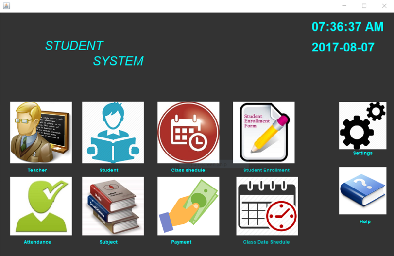
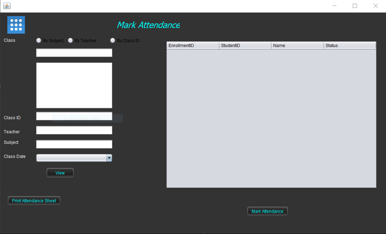
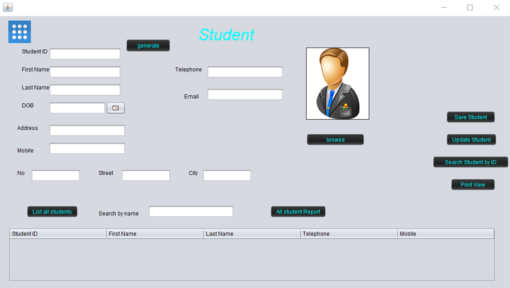

# Student-Management-System
Student Management System implemented in Java and MySQL.

# Some Interfaces

 

 

# Features 
*	Dashboard 
*	User can login as multiple roles
*	View,edit,remove student
*	Student payment management
*	Student attendance management
*	Manage teachers
*	Manage subjects
*	Print reports 

# Used Tools:
* NetBeans 8.2
*	Mysql

